<div align="center">

# 🏃 핏가이드 FitGuide

**처방받은 체력, 스마트하게 증명하세요**

국민체력100 측정 결과를 **8주 맞춤 운동 처방 → 매일 체크인 → 재측정 예상**으로 이어주는 체력 관리 서비스

### [👉 서비스 바로가기 · fitguide-kspo.github.io](https://fitguide-kspo.github.io)

<sub>2026 국민체육진흥공단 공공데이터 활용 경진대회 · 서비스 개발 부문 출품작</sub>

</div>

---

## 📌 한눈에 보기

| | |
|---|---|
| **무엇을** | 국민체력100 체력측정 결과로 약점 체력을 찾아 8주 맞춤 운동을 처방하고, 매일의 실천을 기록해 2차 재측정 결과를 예측합니다. |
| **누구에게** | 국민체력100에서 체력을 측정한 청소년 · 성인 · 어르신 |
| **무엇으로** | 국민체력100 체력측정·운동처방 데이터 **319,296건**, 공식 운동처방 영상 **609개**, 전국 체력인증센터 **79곳** |
| **어떻게** | PC · 모바일 웹에서 설치 없이 바로 이용 |

## 🧪 바로 체험하기

1. [서비스](https://fitguide-kspo.github.io)에 접속해 **⚡ 심사위원 1초 데모 로그인**을 누릅니다.
2. 공공데이터에서 추출한 4명 중 한 명을 고릅니다.
3. 홈에서 **오늘의 운동 체크인하기**로 기록을 남겨보세요.
4. 설정 탭의 **🧪 4주 차 완주 시뮬레이션**을 켜면 4주 동안 기록이 쌓인 모습을 볼 수 있습니다.

> 데모 계정의 이메일 아이디는 가상 정보이며, 측정값은 국민체력100 공공데이터의 실제 측정 기록에서 가져왔습니다.

---

## 💡 왜 필요한가요?

- 국민체력100에서 체력을 측정해도 **결과지 확인에서 끝나는 경우**가 많아, 실제 운동 실천과 재측정으로 이어지기 어렵습니다.
- 결과지의 운동처방은 일반 권고 수준이라 **매일 무엇을 얼마나 해야 할지** 스스로 계획하기 어렵습니다.
- 측정 후 재측정까지 **동기를 이어갈 도구**가 없습니다.

핏가이드는 **공인 측정 → 개인 맞춤 처방 → 매일 실천 기록 → 재측정 예측 · 센터 재방문**을 하나로 연결합니다.

## ✨ 핵심 가치

| 공인 측정 기반 | 실제 데이터로 예측 | 안전한 맞춤 처방 | 정직한 결과 |
|---|---|---|---|
| 실제 측정값 · 등급 · 또래 백분위로 약점 체력을 자동으로 찾아요 | 같은 연령대 · 약점 집단과 재측정 전후 기록으로 2차 측정 예상치를 계산해요 | 혈압 · BMI · 연령에 맞춰 고강도 · 고충격 운동을 자동으로 조정해요 | 2,000회 시뮬레이션으로 범위를 추정하고, 근거가 부족하면 '판정 불가'로 알려요 |

---

## 📱 화면 소개

### 1. 로그인 · 프로필 선택
국민체력100 계정 연동을 가정한 로그인 화면입니다. 심사위원은 공공데이터에서 추출한 4명의 프로필로 바로 체험할 수 있습니다.

<p align="center">
  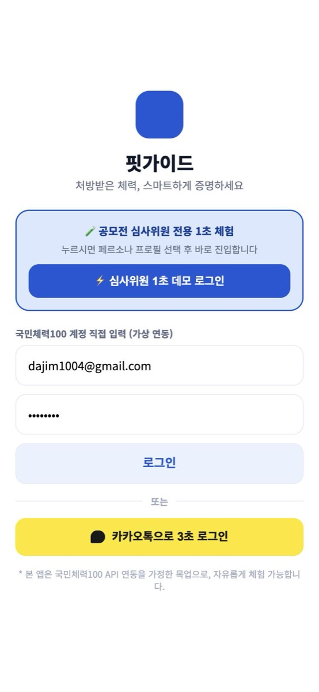
  &nbsp;&nbsp;
  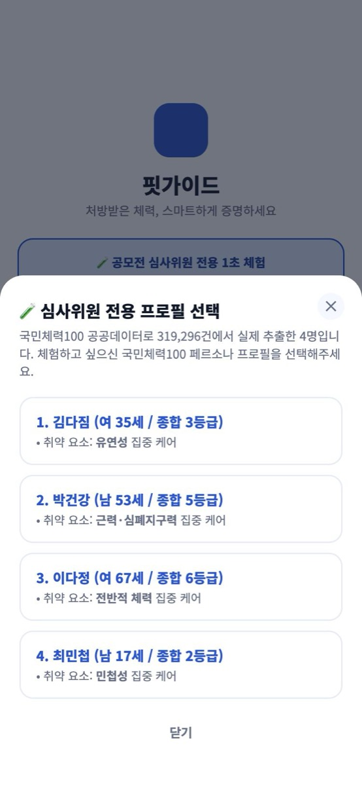
</p>

### 2. 홈 · 오늘의 처방과 체크인
재측정 D-day, 이번 주 목표, 약점을 채우는 오늘의 처방 루틴을 보여줍니다. ▶ 버튼을 누르면 국민체력100 공식 가이드 영상이 재생되고, 체크인 후에는 상태에 맞는 피드백을 줍니다.

<p align="center">
  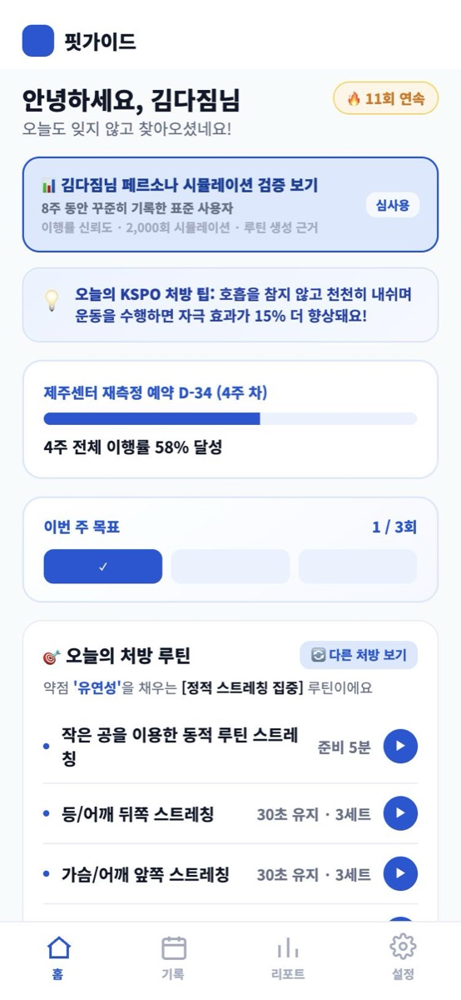
  &nbsp;
  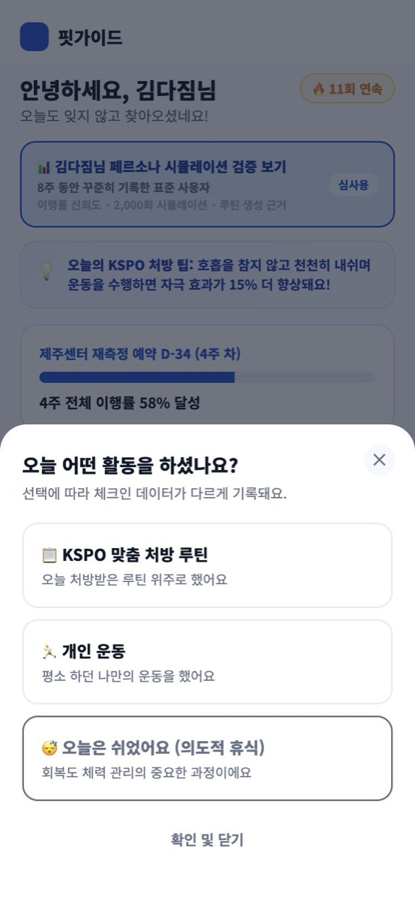
  &nbsp;
  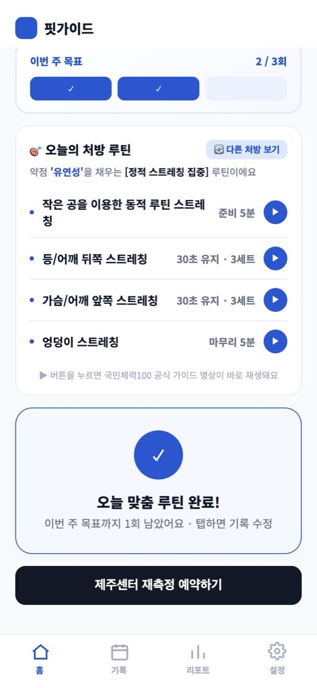
</p>

### 3. 기록 · 요일별 내역과 월간 달력
이번 주 요일별 체크인, 날짜별 상세 기록, 체력 5대 요소 처방 충실도, 월간 출석 달력(이전 · 다음 달 이동)을 제공합니다.

<p align="center">
  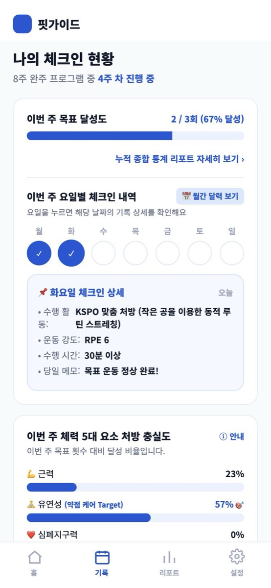
  &nbsp;&nbsp;
  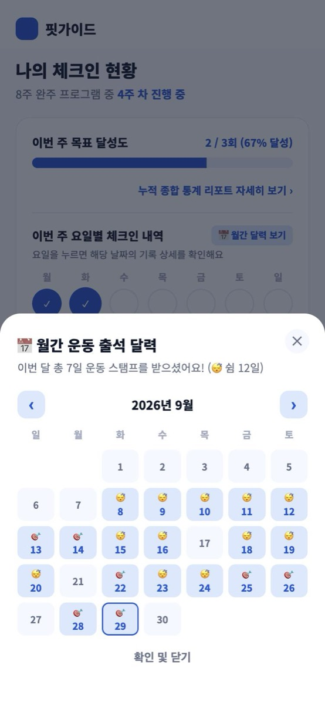
</p>

### 4. 리포트 · 2차 재측정 예상
1차 측정 대비 2차 예상 등급과 약점 항목별 예상값, 체력 5대 요소 레이더 차트, 또래 분포 속 내 위치를 보여줍니다.

<p align="center">
  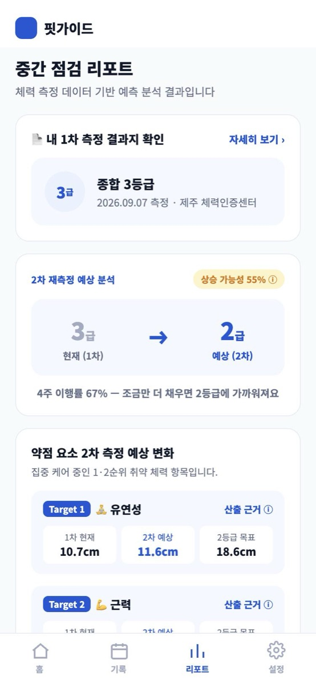
  &nbsp;
  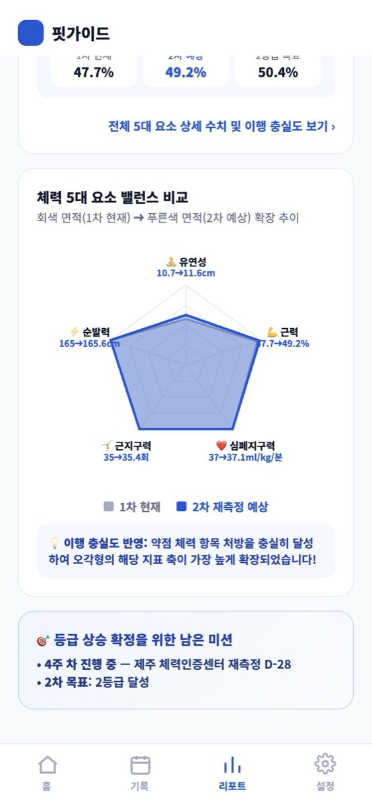
  &nbsp;
  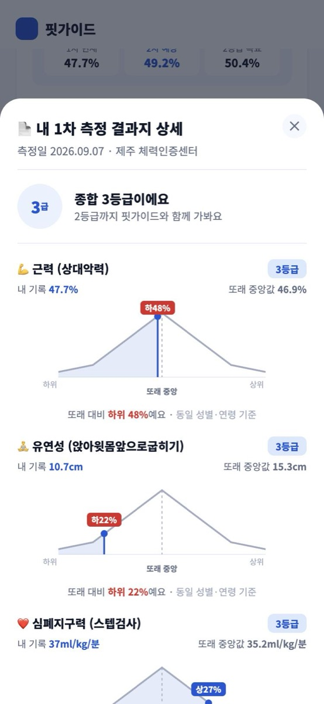
</p>

### 5. 체력인증센터 · 예측 근거
전국 79개 체력인증센터를 내 지역 기준으로 정렬해 센터 상세 · 전화 · 지도로 연결합니다. 심사용 검증 화면에서는 이행률 추정 범위와 계산 근거를 공개합니다.

<p align="center">
  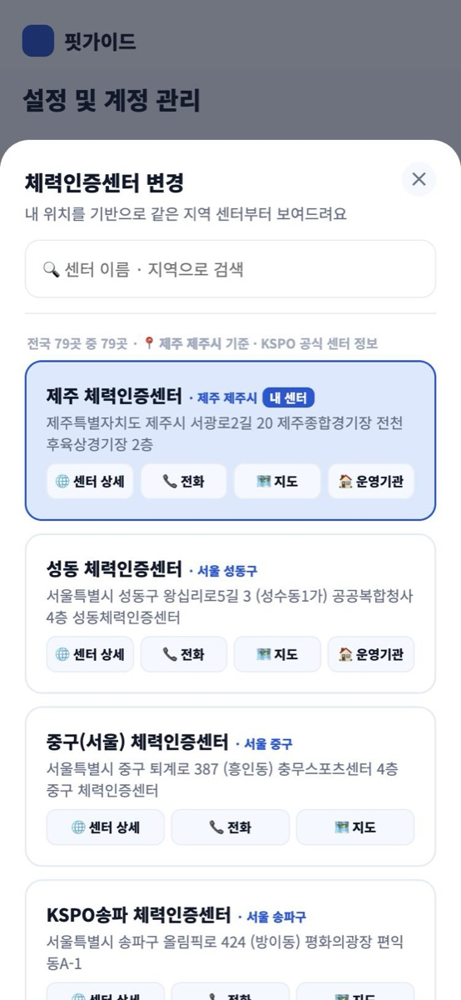
  &nbsp;&nbsp;
  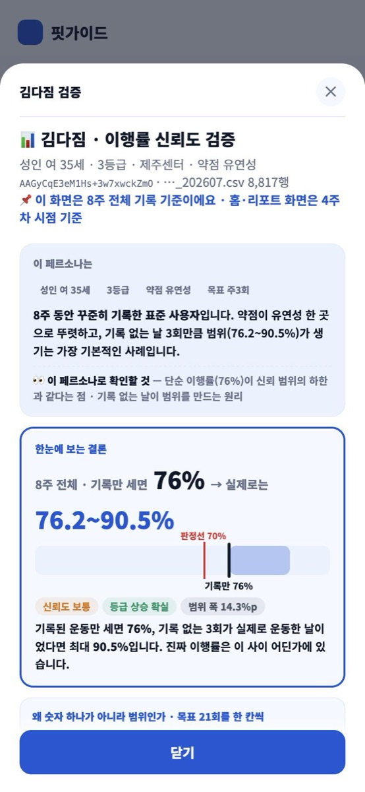
</p>

---

## 📊 활용한 공공데이터

| 데이터 | 규모 | 서비스에서 쓰이는 곳 |
|---|---|---|
| 국민체력100 체력측정 및 운동처방 종합정보 | 319,296건 | 측정 결과지, 또래 비교, 약점 도출, 2차 예상값, 운동 처방, 안전 조건 |
| 국민체력100 운동처방 동영상 | 609개 | 처방 운동별 공식 가이드 영상 |
| 체력인증센터 정보 | 79곳 | 센터 검색 · 정렬, 센터 상세 · 예약 페이지 연결 |

### 데이터가 기능이 되는 방식

| 공공데이터 | 활용 방법 | 화면 |
|---|---|---|
| 측정값 · 등급 | 체력 5대 요소 표시, 약점 요소 자동 도출 | 결과지, 리포트 |
| 연령대 · 약점 집단 (3,435 ~ 8,164명) | 또래 평균 · 백분위 비교 | 결과지 '또래 대비' |
| 재측정 전후 기록 (항목별 44 ~ 871쌍) | 평균 개선폭으로 2차 측정 예상값 계산 | 리포트 '2차 측정 예상 변화' |
| 신체계측 · 혈압 | 혈압 · BMI · 연령별 운동 강도 조정 | 처방 루틴 생성 |
| 운동처방 정보 | 준비 · 본 · 정리운동 구성, 요일별 A/B/C 테마 | 홈 '오늘의 처방 루틴' |
| 운동처방 동영상 | 처방 종목과 공식 영상 매칭 | ▶ 영상 가이드 |
| 체력인증센터 정보 | 지역 정렬, 센터 상세 · 예약 페이지 연결 | 센터 변경, 재측정 예약 |

---

## 🔌 공단 API만 연결하면 바로 운영

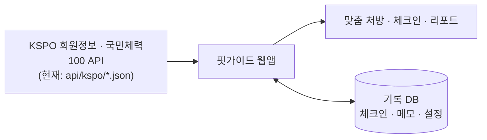

- **쉬운 전환**: 공단 데이터를 불러오는 주소가 `index.html` 하단 `KSPO_API` 한곳에 모여 있어, 주소 4개만 실제 API로 바꾸면 화면 수정 없이 전환됩니다.
- **회원 DB 설계 완료**: 회원 · 신체계측 · 체력 요소 · 센터 · 영상 테이블 구조를 [`db/schema.sql`](db/schema.sql)에 정리했습니다.
- **개인정보 최소 수집**: 별도 회원가입 없이 이용하며, 기록은 본인만 읽고 쓸 수 있도록 행 단위 보안 정책을 적용했습니다.
- **낮은 운영 비용**: 무료 웹 호스팅과 무료 DB로 운영 중입니다.

## 🛠 기술 구성

| 영역 | 사용 기술 |
|---|---|
| 화면 | HTML · CSS · JavaScript (프레임워크 없음), 모바일 우선 반응형 |
| 데이터 | 국민체력100 공공데이터를 API 응답 형태의 JSON으로 가공 |
| 기록 저장 | Supabase (PostgreSQL, 익명 인증, Row Level Security), 연결 실패 시 브라우저 저장 |
| 배포 | GitHub Pages |

<details>
<summary><b>프로젝트 구조</b></summary>

```
index.html                  화면 · 앱 로직
api/kspo/                   "KSPO API" 응답 형태의 데이터 (국민체력100 공공데이터에서 추출)
  members.json              회원 · 체력 5대 요소 (데모 계정 4명)
  fitness-records.json      측정 원천 · 신체계측 · 운동 처방 · 8주 기록
  centers.json              전국 체력인증센터 79곳
  videos.json               운동 가이드 영상 609개
js/config.js                Supabase 연결 정보
js/store.js                 기록 저장 (체크인 · 메모 · 설정)
db/schema.sql               DB 테이블 · 보안 정책
docs/screenshots/           README 화면 캡처
.github/workflows/          DB 정지 방지용 주기 요청
```
</details>

<details>
<summary><b>로컬에서 실행하기</b></summary>

데이터를 `fetch`로 불러오므로 파일을 직접 열지 말고 간단한 서버로 실행합니다.

```bash
python3 -m http.server 8000
```

브라우저에서 http://localhost:8000 을 엽니다.
</details>

---

<sub>※ 2차 재측정 예상값과 이행률은 국민체력100 공공데이터 기반 시뮬레이션 추정치이며, 실제 등급 상승을 보장하지 않습니다.<br>※ 데모 계정의 이메일 아이디는 가상 정보입니다.</sub>
